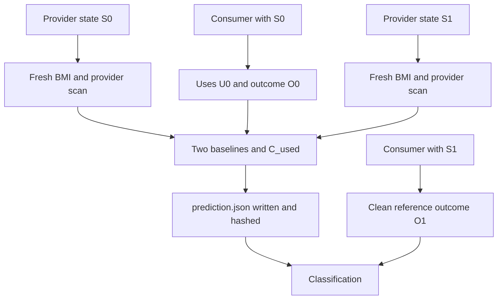

# Architecture

## Component boundary

The repository contains two cooperating implementation components:

- `manalyzer` is a C++ LibTooling executable. Provider mode records exported
  declarations and re-export edges; consumer mode records declaration uses and
  annotated semantic observations.
- `orchestrator` is a Python package and CLI. It creates isolated build states,
  invokes compiler processes and `manalyzer`, evaluates criteria, and produces
  publication artifacts.

The components communicate through versioned JSON files and subprocess exit
statuses. They are not linked into one process: semantic extraction stays in
C++ because it uses Clang's AST APIs, while rapidly changing experiment
automation and result processing stay in Python.

The two root-level build descriptions therefore have separate scopes:

- `CMakeLists.txt` defines common C++ project settings and delegates to
  `analyzer/CMakeLists.txt`;
- `pyproject.toml` packages `python/orchestrator` and installs the
  `orchestrator` CLI.

## Data flow



The criteria API accepts no after-consumer input. `prediction.json` is written
before any command parses the after-consumer, preventing circular evaluation.

## C++ implementation

- `StableId` records a Clang USR plus a structural key. A USR is not assumed to
  be collision-free: constrained function specializations may share one.
- `DeclarationNormalizer` records canonical types, explicit record members,
  templates, constraints, relevant initializers or bodies, and semantic
  attributes. On-demand implicit special members are excluded because their
  materialization otherwise depends on scan context.
- `SemanticVisitor` records exported declarations, export-import edges, direct
  uses, and probe values. Declarations with colliding USRs remain distinct.
- `AnalyzerAction` emits one schema-versioned JSON document per translation
  unit.

For selected function-template specializations, the probe records the primary
function template. Python can therefore distinguish overloads whose
instantiated Clang USRs coincide but whose signatures or constraints differ.

## Python implementation

- `manifest`: scenario loading and semantic validation;
- `build`: explicit BMI commands and isolated module caches;
- `matching`: collision-aware USR, structural, and normalized matching;
- `criteria`: two baselines and the evaluated `C_used` criterion;
- `outcome`: typed semantic observations and composite selection identities;
- `pipeline`: prediction/reference ordering and typed failure handling;
- `aggregate`: JSONL, semicolon-delimited CSV, Markdown, and rates with
  denominators;
- `determinism`: comparison of independent runs after removing only documented
  volatile fields.

## Re-export surface

Each provider scan records direct exported declarations and import edges. The
Python layer recursively follows only edges marked as exported. Loading a BMI
alone does not make its declarations reachable to a consumer.

For `C_used`, matching intentionally searches all tracked provider modules,
not only the new reachable surface. This design exposes cases where pure
used-declaration equality misses a change in re-export reachability.

## Probe contract

Consumer variables are marked with:

```cpp
[[clang::annotate("manalyzer_probe:result")]] auto result = expression;
```

`manalyzer` records initializer type, deduced variable type, selected
declaration, selected class-template specialization when available, and a
constant value when evaluable. The scenario manifest chooses one primary
observation from that record.
